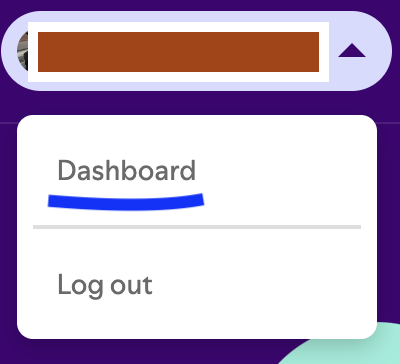
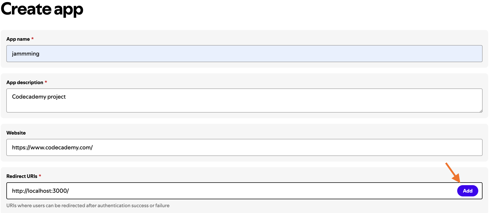
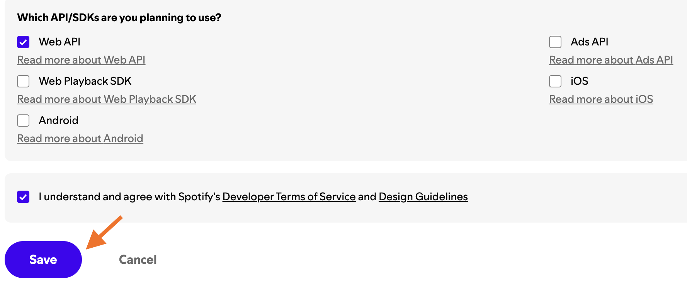
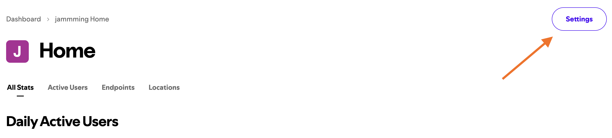
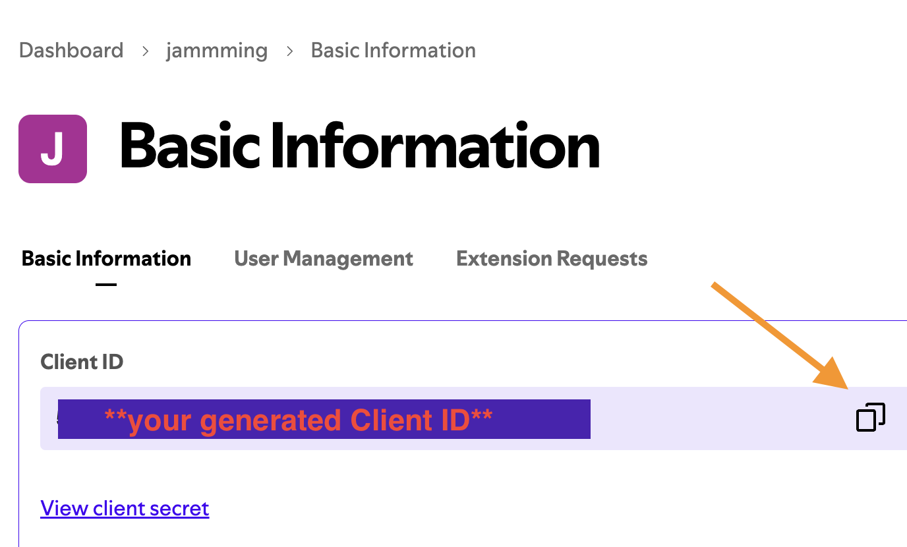

# Jammming

Jammming is a react application run directly on a web browser and allows you to search for songs in the Spotify database based on a given keyword or a keyphrase. Consequently, you can add those songs to a newly created playlist directly in Jammming app and export it to your Spotify account.

> if you want to learn more about Spotify streaming and podcasting service, [click here](https://en.wikipedia.org/wiki/Spotify).

Jammming provides quicker and user-friendlier way of creating a Spotify playlist.

## Initial setup
> Some of the detailed instructions below (such as website button locations) are only applicable for desktop-sized windows of the needed Spotify webpages. Therefore, **I recommend using a large-screen device (such as PC or Mac) for the entire time of the initial setup**.

* First things first, you should already have an existing Spotify account. If you do not have any, create one directly at [Spotify](https://open.spotify.com/).  
* No paid subscription plan of Spotify is not needed for Jammming to function correctly. 
* After you set up your account, move on to the next steps.
### Registering the app in your Spotify and generating Client ID 
Since using Jammming requests songs within the Spotify database   via Spotify Web API, the following steps are needed.

1. Go to [Spotify for Developers](https://developer.spotify.com/) and in the right upper corner click on your user account button and then **Dashboard**.
If you see **Log in** button instead, log in with your Spotify account.

2. Once on the dashboard, click **Create app** button.
3. Now you should see a form with the required information about the an app which is going to be requesting data via Spotify Web API in order to obtain the lists of the searched songs.
Fill in the form as on the pictures below and click **Save** button.

4. Now you should be redirected to Home page of the jammming app. If not, you can access the app from the dashboard. 
Then click the **Settings** button.

5. You should now see Basic Information page and your Client ID in the first field.
Copy the Client ID.

### Setting up the Jammming source code
Now it is time to save your Client ID to the Jammming source code.
1. Provided that you cloned Jammming from my GitHub repository, open the files in your IDE (such as Visual Studio Code).
2. Navigate to 
**src/spotify/spotify.js**
3. On the first line of **spotify.js** you should see a constant variable clientID set to an empty string. Change its value to your Client ID string obtained from your [Spotify for developers account](https://developer.spotify.com/) and save the file.

`const  clientId  =  "YOUR-CLIENT-ID";`

4. You can start using Jammming 🤩

## How to use Jammming

1. Start by typing a query (such as *stupid love*, *california* or *metallica*) into the search field and press the play button.
2. You should then see a list of song results with **+** buttons on their right side.
3. When you click a **+** of a song, the song skips to the playlist section titled with a placeholder **name your playlist**.
4. **name your playlist** serves also as an input field for your custom playlist name (try *My Stupid Love Playlist*).
4. By clicking **Save to Spotify** button you export the newly created and named public playlist to your Spotify account.
5. You can now see and play the playlist in your Spotify.

## Utilized technologies
* React JS
* JavaScript
* HTML, CSS
* Spotify Web API
* Jest testing framework and React testing library

## License
MIT License

Copyright (c) 2025 Tomas Ruzicka

Permission is hereby granted, free of charge, to any person obtaining a copy
of this software and associated documentation files (the "Software"), to deal
in the Software without restriction, including without limitation the rights
to use, copy, modify, merge, publish, distribute, sublicense, and/or sell
copies of the Software, and to permit persons to whom the Software is
furnished to do so, subject to the following conditions:

The above copyright notice and this permission notice shall be included in all
copies or substantial portions of the Software.

THE SOFTWARE IS PROVIDED "AS IS", WITHOUT WARRANTY OF ANY KIND, EXPRESS OR
IMPLIED, INCLUDING BUT NOT LIMITED TO THE WARRANTIES OF MERCHANTABILITY,
FITNESS FOR A PARTICULAR PURPOSE AND NONINFRINGEMENT. IN NO EVENT SHALL THE
AUTHORS OR COPYRIGHT HOLDERS BE LIABLE FOR ANY CLAIM, DAMAGES OR OTHER
LIABILITY, WHETHER IN AN ACTION OF CONTRACT, TORT OR OTHERWISE, ARISING FROM,
OUT OF OR IN CONNECTION WITH THE SOFTWARE OR THE USE OR OTHER DEALINGS IN THE
SOFTWARE.

